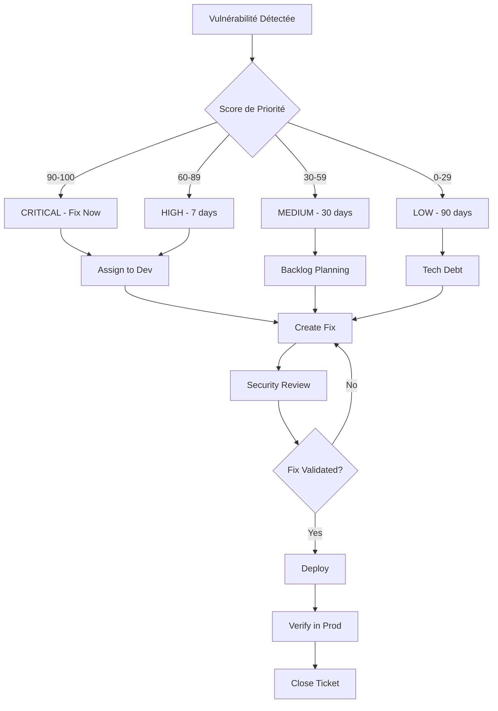

# DevSecOps : Intégrer la Sécurité dans le Pipeline CI/CD

DevSecOps n'est pas juste un buzzword - c'est une nécessité. Avec 43% des cyberattaques ciblant les applications web et 60% des breaches causées par des vulnérabilités non patchées, intégrer la sécurité dès le début du cycle de développement n'est plus optionnel.

Dans cet article, nous allons explorer comment transformer votre pipeline DevOps en DevSecOps de manière pragmatique.

## 📚 Table des Matières

1. [Qu'est-ce que DevSecOps ?](#concept)
2. [Les Piliers du DevSecOps](#piliers)
3. [Pipeline DevSecOps Complet](#pipeline)
4. [Outils Essentiels](#outils)
5. [Implémentation Pratique](#implementation)
6. [Stratégies de Remédiation](#remediation)
7. [Métriques et KPIs](#metriques)
8. [Pièges Courants](#pieges)

---

## 🎯 Qu'est-ce que DevSecOps ? {#concept}

### Définition

**DevSecOps** = **Dev**elopment + **Sec**urity + **Op**erations

C'est l'intégration de pratiques de sécurité **automatisées** à chaque étape du cycle de développement logiciel.

### Le Problème Traditionnel

**Approche classique (waterfall de sécurité) :**
```
Développement (2 mois)
    ↓
Tests Fonctionnels (1 semaine)
    ↓
Audit Sécurité (1 semaine) ← 🔥 Trop tard !
    ↓
Découverte de 50 vulnérabilités
    ↓
Retour aux devs, retard projet
```

**Problèmes :**
- ❌ Sécurité = blocage de dernière minute
- ❌ Coût de correction x10 en production
- ❌ Tensions entre équipes Dev et Sec
- ❌ Délais de déploiement rallongés

### L'Approche DevSecOps

**Pipeline intégré :**
```
Code → Scan SAST → Build → Scan Dependencies → 
Test → Scan DAST → Deploy → Monitoring Runtime
       ↑           ↑              ↑              ↑
   Automatique  Automatique   Automatique   Automatique
```

**Bénéfices :**
- ✅ Détection précoce (shift-left)
- ✅ Coût de correction réduit
- ✅ Déploiements plus rapides
- ✅ Culture de responsabilité partagée

---

## 🏛️ Les 7 Piliers du DevSecOps {#piliers}

### 1. Shift-Left Security

**Principe** : Intégrer la sécurité le plus tôt possible dans le cycle.

```
Shift-Left : Détecter en développement
    ↓
Coût de correction : 1x
Temps de fix : Minutes/Heures

vs

Shift-Right : Détecter en production
    ↓
Coût de correction : 100x
Temps de fix : Jours/Semaines
Impact : Clients affectés
```

### 2. Automation First

**Tout doit être automatisé** :
- Scans de sécurité
- Tests de conformité
- Gestion des secrets
- Patching
- Monitoring

**Pourquoi ?**
- Les humains oublient
- Les humains sont lents
- Les pipelines tournent 24/7

### 3. Security as Code

```yaml
# security-policy.yaml
policies:
  - name: "No critical vulnerabilities"
    severity: CRITICAL
    action: BLOCK_DEPLOYMENT
    
  - name: "Image must be signed"
    check: cosign_verification
    action: BLOCK_DEPLOYMENT
    
  - name: "Container must run as non-root"
    check: user_id != 0
    action: BLOCK_DEPLOYMENT
```

### 4. Defense in Depth

**Plusieurs couches de sécurité** :
```
Application Layer    → WAF, Input Validation
    ↓
Container Layer      → Image Scanning, Runtime Protection
    ↓
Orchestration Layer  → RBAC, Network Policies
    ↓
Infrastructure Layer → Firewall, VPC Isolation
    ↓
Data Layer          → Encryption at Rest/Transit
```

### 5. Least Privilege

```yaml
# Mauvais exemple
apiVersion: v1
kind: ServiceAccount
metadata:
  name: my-app
---
apiVersion: rbac.authorization.k8s.io/v1
kind: ClusterRoleBinding  # ❌ Trop de permissions !
roleRef:
  name: cluster-admin
  
# Bon exemple
apiVersion: rbac.authorization.k8s.io/v1
kind: Role  # ✅ Limité au namespace
rules:
- apiGroups: [""]
  resources: ["pods", "services"]
  verbs: ["get", "list"]  # ✅ Lecture seule
```

### 6. Continuous Monitoring

**Observabilité de la sécurité** :
- Logs d'audit en temps réel
- Alertes sur comportements anormaux
- Métriques de sécurité (CVEs, MTTR)
- Traces distribuées pour détecter les attaques

### 7. Culture de Responsabilité Partagée

```
Avant DevSecOps:
Dev   : "Mon code marche, pas mon problème"
Sec   : "Trop de vulnérabilités, pas de déploiement"
Ops   : "J'applique juste ce qu'on me donne"

Avec DevSecOps:
Tous  : "Nous sommes tous responsables de la sécurité"
      : "Security = Quality = Feature"
```

---

## 🔄 Pipeline DevSecOps Complet {#pipeline}

### Vue d'Ensemble

```mermaid
graph LR
    A[Commit Code] --> B[Pre-commit Hooks]
    B --> C[SAST Scan]
    C --> D[Secret Scanning]
    D --> E[Build Image]
    E --> F[Container Scan]
    F --> G[SBOM Generation]
    G --> H[Sign Image]
    H --> I[Deploy to Staging]
    I --> J[DAST Scan]
    J --> K[Penetration Tests]
    K --> L[Deploy to Prod]
    L --> M[Runtime Monitoring]
```



### Détail par Étape

#### 1. Pre-commit Hooks

```bash
# .git/hooks/pre-commit
#!/bin/bash

# Scan secrets
echo "🔍 Scanning for secrets..."
gitleaks detect --source . || exit 1

# Lint Dockerfiles
echo "🐳 Linting Dockerfiles..."
hadolint Dockerfile || exit 1

# Check IaC security
echo "☁️  Checking Terraform..."
tfsec . || exit 1

echo "✅ Pre-commit checks passed!"
```

#### 2. SAST (Static Application Security Testing)

```yaml
# .gitlab-ci.yml
sast:
  stage: security
  image: returntocorp/semgrep
  script:
    - semgrep --config=auto --json --output=sast-report.json
    - |
      if jq '.results | length > 0' sast-report.json; then
        echo "❌ SAST found vulnerabilities"
        exit 1
      fi
  artifacts:
    reports:
      sast: sast-report.json
```

**Outils SAST populaires** :
- **Semgrep** (multi-langages, rapide)
- **SonarQube** (complet, lourd)
- **CodeQL** (GitHub, puissant)
- **Checkmarx** (commercial, enterprise)

#### 3. Dependency Scanning

```yaml
# Scan des dépendances NPM/Python/etc
dependency-scan:
  stage: security
  script:
    # NPM
    - npm audit --production --audit-level=moderate
    
    # Python
    - pip-audit
    
    # Scan multi-langage
    - trivy fs --severity HIGH,CRITICAL .
  allow_failure: false  # Bloque si vulns critiques
```

#### 4. Container Image Scanning

```yaml
container-scan:
  stage: security
  image: aquasec/trivy
  script:
    - trivy image --exit-code 1 --severity CRITICAL myapp:$CI_COMMIT_SHA
    - trivy image --exit-code 0 --severity HIGH myapp:$CI_COMMIT_SHA
  artifacts:
    reports:
      container_scanning: trivy-report.json
```

**Exemple de vulnérabilité détectée** :
```json
{
  "vulnerabilities": [
    {
      "id": "CVE-2024-1234",
      "package": "openssl",
      "version": "1.1.1k",
      "severity": "CRITICAL",
      "fixed_version": "1.1.1l",
      "description": "Remote code execution in OpenSSL"
    }
  ]
}
```

#### 5. SBOM (Software Bill of Materials)

```bash
# Générer un SBOM avec Syft
syft packages myapp:latest -o spdx-json > sbom.json

# Vérifier les vulnérabilités dans le SBOM
grype sbom:./sbom.json
```

**Pourquoi c'est important ?**
- Traçabilité complète des composants
- Réponse rapide en cas de 0-day (Log4Shell)
- Conformité réglementaire (Executive Order 14028)

#### 6. Image Signing

```bash
# Signer l'image avec Cosign
cosign sign --key cosign.key myapp:$VERSION

# Vérifier la signature
cosign verify --key cosign.pub myapp:$VERSION
```

**Policy dans Kubernetes** :
```yaml
# Kyverno policy
apiVersion: kyverno.io/v1
kind: ClusterPolicy
metadata:
  name: verify-image-signature
spec:
  validationFailureAction: enforce
  rules:
  - name: verify-signature
    match:
      resources:
        kinds:
        - Pod
    verifyImages:
    - imageReferences:
      - "myregistry.io/*"
      attestors:
      - entries:
        - keys:
            publicKeys: |-
              -----BEGIN PUBLIC KEY-----
              ...
              -----END PUBLIC KEY-----
```

#### 7. DAST (Dynamic Application Security Testing)

```yaml
dast:
  stage: security
  image: owasp/zap2docker-stable
  script:
    - zap-baseline.py -t https://staging.myapp.com -r zap-report.html
  artifacts:
    paths:
      - zap-report.html
    reports:
      dast: zap-report.json
```

**Tests DAST typiques** :
- Injection SQL
- XSS (Cross-Site Scripting)
- CSRF (Cross-Site Request Forgery)
- Mauvaise configuration headers (CSP, CORS)
- Authentification faible

#### 8. Runtime Security

```yaml
# Falco rules pour détecter comportements suspects
- rule: Unauthorized Process Execution
  desc: Detect processes not in whitelist
  condition: >
    spawned_process and
    container and
    not proc.name in (node, npm, sh)
  output: "Unauthorized process in container (proc=%proc.name)"
  priority: CRITICAL
```

---

## 🛠️ Outils Essentiels par Catégorie {#outils}

### SAST (Analyse Statique)

| Outil | Langages | Prix | Recommandation |
|-------|----------|------|----------------|
| **Semgrep** | 30+ | Gratuit (OSS) | ⭐⭐⭐⭐⭐ Meilleur rapport qualité/prix |
| **SonarQube** | 25+ | Gratuit + Paid | ⭐⭐⭐⭐ Complet mais lourd |
| **CodeQL** | 12 | Gratuit (GitHub) | ⭐⭐⭐⭐⭐ Excellent si GitHub |
| **Snyk Code** | 10+ | Freemium | ⭐⭐⭐ Bon pour JS/Python |

### SCA (Software Composition Analysis)

| Outil | Focus | Prix | Recommandation |
|-------|-------|------|----------------|
| **Trivy** | Conteneurs + IaC | Gratuit | ⭐⭐⭐⭐⭐ Must-have |
| **Snyk** | Multi-écosystème | Freemium | ⭐⭐⭐⭐ Excellent UX |
| **Grype** | Conteneurs | Gratuit | ⭐⭐⭐⭐ Alternative Trivy |
| **OWASP Dependency-Check** | Multi-langage | Gratuit | ⭐⭐⭐ Solide mais lent |

### Container Security

| Outil | Capacités | Prix | Recommandation |
|-------|-----------|------|----------------|
| **Trivy** | Scan images | Gratuit | ⭐⭐⭐⭐⭐ Incontournable |
| **Clair** | Scan images | Gratuit | ⭐⭐⭐ Alternative |
| **Falco** | Runtime detection | Gratuit | ⭐⭐⭐⭐⭐ Must-have K8s |
| **Aqua Security** | Suite complète | Commercial | ⭐⭐⭐⭐ Enterprise |

### Secret Management

| Outil | Use Case | Prix | Recommandation |
|-------|----------|------|----------------|
| **HashiCorp Vault** | Secrets centralisés | Gratuit + Paid | ⭐⭐⭐⭐⭐ Standard industrie |
| **AWS Secrets Manager** | AWS natif | Pay-as-you-go | ⭐⭐⭐⭐ Si AWS |
| **Sealed Secrets** | K8s natif | Gratuit | ⭐⭐⭐⭐ Simple et efficace |
| **gitleaks** | Secret scanning | Gratuit | ⭐⭐⭐⭐⭐ Pre-commit hook |

### DAST (Analyse Dynamique)

| Outil | Type | Prix | Recommandation |
|-------|------|------|----------------|
| **OWASP ZAP** | Full-featured | Gratuit | ⭐⭐⭐⭐⭐ Open source référence |
| **Burp Suite** | Pro testing | Paid | ⭐⭐⭐⭐⭐ Best for pentest |
| **Nuclei** | Fast scanning | Gratuit | ⭐⭐⭐⭐ Automatisation |

### IaC Security

| Outil | Support | Prix | Recommandation |
|-------|---------|------|----------------|
| **tfsec** | Terraform | Gratuit | ⭐⭐⭐⭐⭐ Must-have |
| **Checkov** | Multi-IaC | Gratuit | ⭐⭐⭐⭐ Très complet |
| **Terrascan** | Multi-IaC | Gratuit | ⭐⭐⭐ Bon alternatif |

---

## 💻 Implémentation Pratique {#implementation}

### Exemple 1 : Pipeline GitLab CI/CD Complet

```yaml
# .gitlab-ci.yml
stages:
  - security-pre
  - build
  - security-post
  - deploy

variables:
  IMAGE_NAME: myapp
  IMAGE_TAG: $CI_COMMIT_SHORT_SHA

# ===== SECURITY PRE-BUILD =====

secrets-scan:
  stage: security-pre
  image: zricethezav/gitleaks:latest
  script:
    - gitleaks detect --source . --verbose --exit-code 1
  allow_failure: false

sast:
  stage: security-pre
  image: returntocorp/semgrep
  script:
    - semgrep --config=auto --sarif --output=sast.sarif
  artifacts:
    reports:
      sast: sast.sarif

dependency-scan:
  stage: security-pre
  image: aquasec/trivy:latest
  script:
    - trivy fs --exit-code 1 --severity CRITICAL,HIGH .
  allow_failure: false

iac-scan:
  stage: security-pre
  image: aquasec/tfsec:latest
  script:
    - tfsec . --minimum-severity HIGH
  only:
    changes:
      - "**/*.tf"

# ===== BUILD =====

build-image:
  stage: build
  image: docker:latest
  services:
    - docker:dind
  before_script:
    - docker login -u $CI_REGISTRY_USER -p $CI_REGISTRY_PASSWORD $CI_REGISTRY
  script:
    - docker build -t $CI_REGISTRY_IMAGE:$IMAGE_TAG .
    - docker push $CI_REGISTRY_IMAGE:$IMAGE_TAG
  dependencies:
    - sast
    - dependency-scan

# ===== SECURITY POST-BUILD =====

container-scan:
  stage: security-post
  image: aquasec/trivy:latest
  script:
    - trivy image --exit-code 1 --severity CRITICAL $CI_REGISTRY_IMAGE:$IMAGE_TAG
    - trivy image --exit-code 0 --severity HIGH,MEDIUM $CI_REGISTRY_IMAGE:$IMAGE_TAG
  artifacts:
    reports:
      container_scanning: trivy-report.json

sbom-generation:
  stage: security-post
  image: anchore/syft:latest
  script:
    - syft packages $CI_REGISTRY_IMAGE:$IMAGE_TAG -o spdx-json > sbom.json
  artifacts:
    paths:
      - sbom.json

image-signing:
  stage: security-post
  image: gcr.io/projectsigstore/cosign:latest
  script:
    - cosign sign --key $COSIGN_PRIVATE_KEY $CI_REGISTRY_IMAGE:$IMAGE_TAG

# ===== DEPLOY =====

deploy-staging:
  stage: deploy
  image: bitnami/kubectl:latest
  script:
    - kubectl apply -f k8s/staging/
    - kubectl set image deployment/myapp myapp=$CI_REGISTRY_IMAGE:$IMAGE_TAG
  environment:
    name: staging
  only:
    - main

dast-scan:
  stage: deploy
  image: owasp/zap2docker-stable:latest
  script:
    - zap-baseline.py -t https://staging.myapp.com -J zap-report.json
  artifacts:
    reports:
      dast: zap-report.json
  dependencies:
    - deploy-staging
```

### Exemple 2 : Configuration Kubernetes Sécurisée

```yaml
# deployment.yaml
apiVersion: apps/v1
kind: Deployment
metadata:
  name: myapp
spec:
  replicas: 3
  template:
    metadata:
      labels:
        app: myapp
    spec:
      # ✅ Service account dédié
      serviceAccountName: myapp-sa
      
      # ✅ Security Context au niveau Pod
      securityContext:
        runAsNonRoot: true
        runAsUser: 1000
        fsGroup: 2000
        seccompProfile:
          type: RuntimeDefault
      
      containers:
      - name: myapp
        image: myregistry.io/myapp:v1.2.3
        
        # ✅ Security Context au niveau Container
        securityContext:
          allowPrivilegeEscalation: false
          readOnlyRootFilesystem: true
          capabilities:
            drop:
              - ALL
            add:
              - NET_BIND_SERVICE  # Seulement ce qui est nécessaire
        
        # ✅ Resource limits
        resources:
          requests:
            memory: "128Mi"
            cpu: "100m"
          limits:
            memory: "256Mi"
            cpu: "200m"
        
        # ✅ Liveness/Readiness probes
        livenessProbe:
          httpGet:
            path: /health
            port: 8080
          initialDelaySeconds: 30
        
        readinessProbe:
          httpGet:
            path: /ready
            port: 8080
          initialDelaySeconds: 5
        
        # ✅ Secrets via env (chargés depuis Vault)
        env:
        - name: DB_PASSWORD
          valueFrom:
            secretKeyRef:
              name: myapp-secrets
              key: db-password
        
        # ✅ Volume pour écriture temporaire
        volumeMounts:
        - name: tmp
          mountPath: /tmp
        - name: cache
          mountPath: /app/cache
      
      volumes:
      - name: tmp
        emptyDir: {}
      - name: cache
        emptyDir: {}

---
# NetworkPolicy pour isoler le trafic
apiVersion: networking.k8s.io/v1
kind: NetworkPolicy
metadata:
  name: myapp-netpol
spec:
  podSelector:
    matchLabels:
      app: myapp
  policyTypes:
  - Ingress
  - Egress
  ingress:
  - from:
    - podSelector:
        matchLabels:
          app: nginx-ingress
    ports:
    - protocol: TCP
      port: 8080
  egress:
  - to:
    - podSelector:
        matchLabels:
          app: postgres
    ports:
    - protocol: TCP
      port: 5432
  - to:  # Allow DNS
    - namespaceSelector: {}
      podSelector:
        matchLabels:
          k8s-app: kube-dns
    ports:
    - protocol: UDP
      port: 53
```

### Exemple 3 : Gestion des Secrets avec Vault

```python
# app.py - Intégration HashiCorp Vault
import hvac
import os

class VaultClient:
    def __init__(self):
        self.client = hvac.Client(
            url=os.getenv('VAULT_ADDR'),
            token=os.getenv('VAULT_TOKEN')  # Ou auth Kubernetes
        )
    
    def get_secret(self, path):
        """Récupère un secret depuis Vault"""
        try:
            response = self.client.secrets.kv.v2.read_secret_version(
                path=path,
                mount_point='secret'
            )
            return response['data']['data']
        except Exception as e:
            print(f"Error fetching secret: {e}")
            raise
    
    def rotate_secret(self, path, new_value):
        """Rotate un secret"""
        self.client.secrets.kv.v2.create_or_update_secret(
            path=path,
            secret=new_value,
            mount_point='secret'
        )

# Utilisation
vault = VaultClient()
db_creds = vault.get_secret('myapp/database')
print(f"DB User: {db_creds['username']}")
# ❌ Ne jamais logger le password !
```

```bash
# Script de rotation automatique des secrets
#!/bin/bash
# rotate-secrets.sh

# Générer un nouveau password
NEW_PASSWORD=$(openssl rand -base64 32)

# Mettre à jour dans Vault
vault kv put secret/myapp/database password="$NEW_PASSWORD"

# Mettre à jour dans la base de données
psql -h db.example.com -U admin -c \
  "ALTER USER app_user WITH PASSWORD '$NEW_PASSWORD';"

# Redémarrer les pods pour charger le nouveau secret
kubectl rollout restart deployment/myapp

echo "✅ Secret rotated successfully"
```

---

## 🔧 Stratégies de Remédiation {#remediation}

### Approche par Priorité

```python
# Système de scoring des vulnérabilités
class VulnerabilityScorer:
    def calculate_priority(self, vuln):
        score = 0
        
        # Sévérité (0-40 points)
        severity_scores = {
            'CRITICAL': 40,
            'HIGH': 30,
            'MEDIUM': 15,
            'LOW': 5
        }
        score += severity_scores.get(vuln['severity'], 0)
        
        # Exploitabilité (0-30 points)
        if vuln.get('exploit_available'):
            score += 30
        elif vuln.get('exploit_poc'):
            score += 20
        
        # Exposition (0-20 points)
        if vuln.get('public_facing'):
            score += 20
        elif vuln.get('internal_network'):
            score += 10
        
        # Impact métier (0-10 points)
        if vuln.get('business_critical'):
            score += 10
        
        return score
    
    def prioritize_vulns(self, vulnerabilities):
        scored = [(v, self.calculate_priority(v)) for v in vulnerabilities]
        return sorted(scored, key=lambda x: x[1], reverse=True)

# Exemple d'utilisation
vulns = [
    {
        'id': 'CVE-2024-1234',
        'severity': 'CRITICAL',
        'exploit_available': True,
        'public_facing': True,
        'business_critical': True
    },
    {
        'id': 'CVE-2024-5678',
        'severity': 'HIGH',
        'exploit_available': False,
        'public_facing': False,
        'business_critical': False
    }
]

scorer = VulnerabilityScorer()
prioritized = scorer.prioritize_vulns(vulns)

for vuln, score in prioritized:
    print(f"{vuln['id']}: Score {score} - {'FIX NOW' if score > 70 else 'Schedule'}")
```

### SLA de Remédiation

| Sévérité | Score | SLA | Exemple |
|----------|-------|-----|---------|
| **CRITICAL** | 90-100 | 24h | RCE exploité activement |
| **HIGH** | 60-89 | 7 jours | SQLi avec exploit PoC |
| **MEDIUM** | 30-59 | 30 jours | XSS non exploité |
| **LOW** | 0-29 | 90 jours | Info disclosure mineur |

### Workflow de Remédiation



---

## 📊 Métriques et KPIs {#metriques}

### Métriques de Pipeline

```python
# dashboard.py - Métriques DevSecOps
class DevSecOpsMetrics:
    def __init__(self):
        self.metrics = {}
    
    def calculate_security_debt(self):
        """Calcule la dette de sécurité"""
        vulns = self.get_all_vulnerabilities()
        
        # Coût estimé par sévérité (en heures)
        cost_per_severity = {
            'CRITICAL': 8,
            'HIGH': 4,
            'MEDIUM': 2,
            'LOW': 0.5
        }
        
        total_hours = sum(
            cost_per_severity.get(v['severity'], 0) 
            for v in vulns
        )
        
        return {
            'total_vulns': len(vulns),
            'estimated_hours': total_hours,
            'estimated_cost': total_hours * 100  # 100€/heure
        }
    
    def mean_time_to_remediate(self, severity='all'):
        """MTTR moyen par sévérité"""
        vulns = self.get_remediated_vulnerabilities()
        
        if severity != 'all':
            vulns = [v for v in vulns if v['severity'] == severity]
        
        times = [v['closed_at'] - v['detected_at'] for v in vulns]
        return sum(times, timedelta()) / len(times) if times else timedelta()
    
    def deployment_frequency_with_security(self):
        """Fréquence de déploiement sans régression sécu"""
        deployments = self.get_deployments(last_30_days=True)
        
        safe_deployments = [
            d for d in deployments 
            if d['security_gate_passed']
        ]
        
        return {
            'total': len(deployments),
            'safe': len(safe_deployments),
            'percentage': len(safe_deployments) / len(deployments) * 100
        }
```

### Dashboard Exemple

```
┌─────────────────────────────────────────────────────────────┐
│                  DevSecOps Dashboard                        │
├─────────────────────────────────────────────────────────────┤
│                                                             │
│  Security Posture                                           │
│  ─────────────────                                          │
│  Critical:    2  ⚠️   (SLA: 24h)                           │
│  High:       15  ⚠️   (SLA: 7d)                            │
│  Medium:     43  ⓘ    (SLA: 30d)                           │
│  Low:        89  ✓    (SLA: 90d)                           │
│                                                             │
│  Security Debt: 124 hours (~12.4k€)                        │
│                                                             │
│  MTTR by Severity                                           │
│  ─────────────────                                          │
│  Critical:   18h  ✓   (Target: 24h)                        │
│  High:        4d  ✓   (Target: 7d)                         │
│  Medium:     18d  ✓   (Target: 30d)                        │
│                                                             │
│  Pipeline Metrics (Last 30 days)                           │
│  ────────────────────────────────                           │
│  Deployments:           156                                 │
│  Security Gate Pass:    143 (91.7%) ✓                      │
│  Blocked Deployments:    13 (8.3%)                          │
│                                                             │
│  Vulnerability Trends                                       │
│  ─────────────────────                                      │
│  Week 1:  █████████░░░░░░░░░  45 vulns                      │
│  Week 2:  ████████░░░░░░░░░░  40 vulns                      │
│  Week 3:  ██████░░░░░░░░░░░░  30 vulns ↓                    │
│  Week 4:  █████░░░░░░░░░░░░░  25 vulns ↓                    │
│                                                             │
└─────────────────────────────────────────────────────────────┘
```

---

## ⚠️ Pièges Courants et Solutions {#pieges}

### Piège 1 : Trop d'Outils, Pas de Stratégie

**Erreur** :
```
❌ "On va installer tous les outils de sécurité !"
→ 15 outils différents
→ Personne ne les maintient
→ Faux positifs ignorés
→ Alert fatigue
```

**Solution** :
```yaml
# Approche minimaliste efficace
essential_tools:
  sast: semgrep        # 1 outil, bien configuré
  sca: trivy           # Couvre conteneurs + dépendances
  secrets: gitleaks    # Simple et efficace
  iac: tfsec          # Spécialisé Terraform
  runtime: falco       # Detection Kubernetes
```

### Piège 2 : Bloquer Systématiquement

**Erreur** :
```python
# Configuration trop stricte
if vulnerabilities_found:
    block_deployment()  # ❌ Bloque TOUT
```

**Solution** :
```python
# Configuration graduée
def should_block_deployment(vulns):
    critical = [v for v in vulns if v['severity'] == 'CRITICAL']
    
    # Bloquer uniquement les critiques
    if critical and any(v.get('exploit_available') for v in critical):
        return True, "Critical exploitable vulnerability found"
    
    # Avertir pour le reste
    return False, f"Found {len(vulns)} non-critical vulnerabilities"
```

### Piège 3 : Ignorer le Context

**Erreur** :
```
CVE-2024-1234 in library X version 1.0
→ Block deployment
→ Mais... on n'utilise pas la fonction vulnérable !
```

**Solution** :
```yaml
# Suppression contextuelle
suppressions:
  - cve: CVE-2024-1234
    package: library-x
    reason: "Vulnerable function not used in our code"
    verified_by: security-team
    expires: 2024-12-31
    recheck: true
```

### Piège 4 : Oublier la Formation

**Problème** :
```
Devs : "Le pipeline est rouge, je contourne les checks"
Sec  : "Pourquoi personne ne corrige les vulns ?"
```

**Solution** :
```markdown
# Programme de Formation DevSecOps

## Phase 1 : Awareness (Tous)
- Pourquoi DevSecOps ?
- OWASP Top 10
- Impact business des breaches

## Phase 2 : Hands-on Devs
- Secure coding practices
- Utilisation des outils (Semgrep, Trivy)
- Fix des vulnérabilités courantes

## Phase 3 : Advanced (Security Champions)
- Threat modeling
- Security review
- Incident response

## Phase 4 : Gamification
- CTF interne mensuel
- Bug bounty interne
- Reconnaissance publique
```

---

## 🎯 Checklist de Démarrage DevSecOps

### Semaine 1 : Quick Wins

- [ ] Installer pre-commit hooks (gitleaks + hadolint)
- [ ] Ajouter Trivy scan dans CI/CD
- [ ] Activer Dependabot/Renovate pour auto-updates
- [ ] Configurer secrets management (Vault ou équivalent)
- [ ] Documenter policy de sécurité

### Mois 1 : Fondations

- [ ] Implémenter SAST (Semgrep)
- [ ] Scanner toutes les images de conteneurs
- [ ] Établir baseline de vulnérabilités
- [ ] Définir SLA de remédiation
- [ ] Former l'équipe sur basics

### Trimestre 1 : Maturité

- [ ] DAST sur environnement staging
- [ ] Runtime security (Falco)
- [ ] Dashboard de métriques
- [ ] Security champions par équipe
- [ ] Post-mortem de sécurité réguliers

---

## 📚 Ressources Pour Aller Plus Loin

### Cours et Certifications

- **Certified DevSecOps Professional (CDP)** - Practical DevSecOps
- **AWS Certified Security - Specialty**
- **GIAC Security Essentials (GSEC)**

### Livres

- "The DevOps Handbook" - Gene Kim
- "Continuous Delivery" - Jez Humble
- "Accelerate" - Nicole Forsgren

### Communautés

- [OWASP DevSecOps](https://owasp.org/www-project-devsecops-guideline/)
- [Cloud Native Security](https://www.cncf.io/projects/security/)
- [DevSecOps subreddit](https://reddit.com/r/devops)

### Labs Pratiques

- [Kubernetes Goat](https://github.com/madhuakula/kubernetes-goat) - K8s security training
- [OWASP Juice Shop](https://owasp.org/www-project-juice-shop/) - Web app security
- [DVWA](https://github.com/digininja/DVWA) - Damn Vulnerable Web App

---

## 💭 Conclusion

DevSecOps n'est pas qu'une question d'outils. C'est avant tout une **transformation culturelle** :

```
Security ≠ Obstacle
Security = Enabler
Security = Quality
Security = Everyone's Job
```

**Les 3 Règles d'Or** :

1. **Start Small** : Un outil bien configuré > 10 outils mal utilisés
2. **Automate Everything** : Si c'est manuel, ça ne sera pas fait
3. **Iterate Continuously** : La sécurité est un voyage, pas une destination

**Le succès de DevSecOps se mesure quand** :
- ✅ Les devs fixent les vulns avant que la sécu les voie
- ✅ Les déploiements sont plus rapides ET plus sûrs
- ✅ La sécurité n'est plus "nous vs eux"
- ✅ Les incidents de sécurité diminuent

---

**Question pour vous** : Par où allez-vous commencer ? Gitleaks pre-commit hooks ? Trivy dans votre CI ? Partagez dans les commentaires ! 💬
